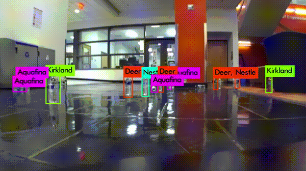
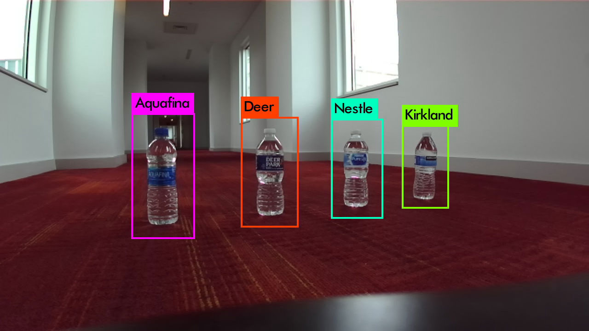
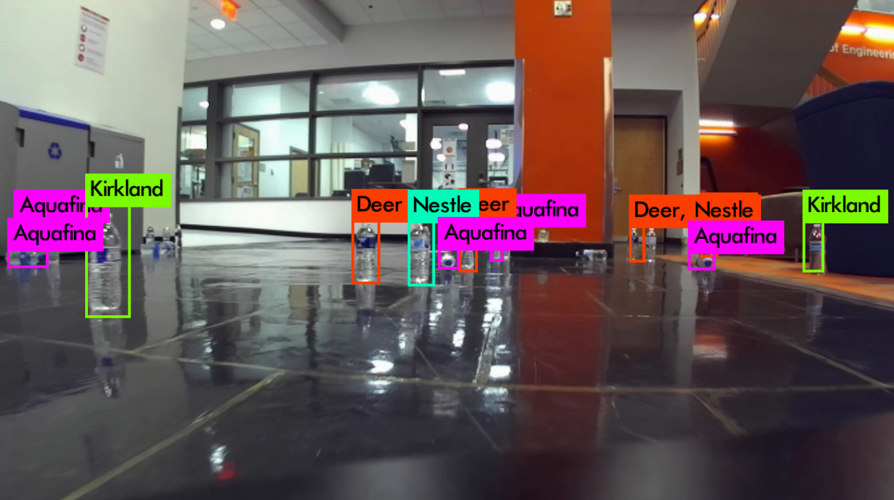
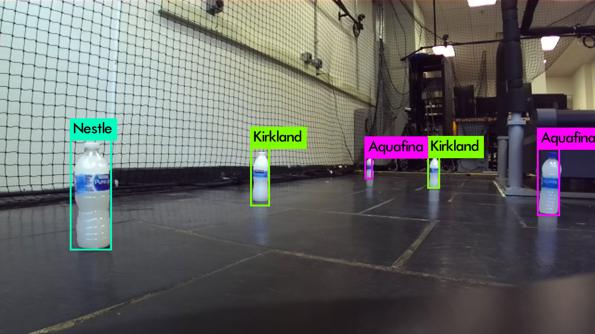

# Yolov3 Bottle Detector
A Yolov3-based bottle brand detector, which is trained from a custom dataset with four brands of mineral water bottles.

 

## Custom Bottle Dataset:
This bottle dataset consists of 4870 images of four brands of mineral water bottles (i.e. Aquafina, Deer, Kirkland and Nestle). Images were collected by the turtlebot 2 robot and smart phone in four different environments: lobby, laboratory, corridor, and living room. 

**Size** 
* 4000 training images
* 870 validation images

**Bottle Classes**
* Aquafina
* Deer
* Kirkland
* Nestle

**Format**
* PASCAL VOC
* Darknet

**Download link**
* https: 

**Dataset Folder Structure**
* Annotations: contains the xml label files in PASCAL VOC format
* ImageSets: contains the training index files 
* JPEGImages: contains the image data in jpg format
* Labels: contains the txt label files in Darknet format

**Sample labeled Images**
   

## YOLOV3 Tiny Bottle Detector:
This bottle detector is a pretrained yolov3-tiny model fine-tuned by our custom bottle dataset shown above. 

**Network Configure File**
* ./cfg/yolov3-tiny-sphd.cfg

**Two pretrained models**
* ./weights/yolov3_tiny_sphd_25000_paper.weights: specially used in our SPHD filer paper "The Semantic PHD Filter for Multi-class TargetTracking: From Theory to Practice"
* ./weights/yolov3_tiny_30000_general.weights: general purpose (recommend)

**Requirements**
* install darknet package: https://github.com/pjreddie/darknet  

**Video Demo**
* ./demo/bottle_detection_demo.mp4

## Citation

